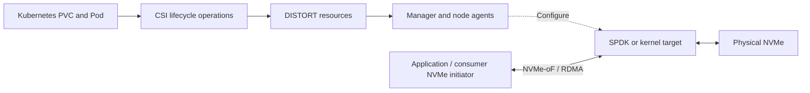

## Welcome to DISTORT

**DISTORT (DISaggregated STorage Over RDMA Transport)** manages physical NVMe
storage for Kubernetes workloads over NVMe-over-Fabrics/RDMA. Administrators
explicitly claim unused devices; applications request filesystem volumes using
StorageClasses and PersistentVolumeClaims.

Kubernetes custom resources coordinate discovery, allocation, exports, and
consumer ownership. Node agents configure SPDK or Linux kernel targets, while
the CSI driver connects and mounts volumes on consumer nodes. After setup,
application I/O travels directly over RDMA without passing through the manager.

---

### Project Status

DISTORT is an alpha-stage project moving toward beta. Version `0.5.0` is a
development release and is not recommended for production use. The project has
been tested with K3s 1.35.4 in its three-node Vagrant lab and with Kubernetes
1.35.5 in a three-node kubeadm cluster.

These are tested configurations, not a compatibility certification. The current
driver supports ext4/XFS mounted single-node-writer volumes. Raw block, multi-node
access, snapshots, cloning, expansion, replication, multipath failover, and an
NVMe/TCP fallback are not implemented. See the
[roadmap](https://github.com/CARV-ICS-FORTH/distort/blob/main/ROADMAP.md) for proposed work.

---

### Control and data paths

---

### Getting Started

Explore the different sections of the documentation to understand and consume DISTORT:

- **[Architecture](/architecture/)**: Read the design, component roles, control and data paths, and implementation layout.
- **[Project Internals](/internals/)**: Follow the controller, agent, CSI, and storage data paths in detail, including recovery boundaries.
- **[Using DISTORT](/using/)**: Learn how to discover underlying storage controllers, claim hardware drives using `NVMeDeviceClaim` specs, and request StorageClasses.
- **[Local Testing Lab](/local-testing/)**: Keep a three-node Vagrant/K3s cluster running for fast redeploys, manual storage checks, and automated E2E tests.
- **[Testing Strategy](/testing/)**: Run the host-side, regression, and hardware test suites.
- **[Contributing](/contributing/)**: Build, generate, validate, and submit changes using the repository's supported workflows.

### Community

Ask questions and propose changes through
[GitHub Issues](https://github.com/CARV-ICS-FORTH/distort/issues), or contact the
[maintainers](https://github.com/CARV-ICS-FORTH/distort/blob/main/MAINTAINERS.md).
Follow the [Code of Conduct](https://github.com/CARV-ICS-FORTH/distort/blob/main/CODE_OF_CONDUCT.md)
and use the [private security reporting process](https://github.com/CARV-ICS-FORTH/distort/blob/main/SECURITY.md)
for vulnerabilities. The [governance policy](https://github.com/CARV-ICS-FORTH/distort/blob/main/GOVERNANCE.md)
describes how maintainers make decisions.
