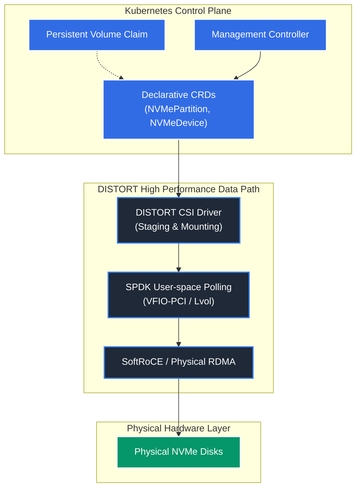

## Welcome to DISTORT

**DISTORT (DISaggregated STorage Over Rdma Transport)** is a high-performance, Kubernetes-native storage engine that bridges the gap between physical disaggregated storage fabrics and dynamic container environments.

As cloud-native architectures become the standard for deploying scalable applications, the demand for high-performance, low-latency storage has surged. Disaggregated storage, particularly NVMe-over-Fabrics (NVMe-oF) using Remote Direct Memory Access (RDMA), offers a promising solution by decoupling storage capacity from compute nodes, maintaining near-local access speeds. 

However, integrating physical RDMA targets with the dynamic, containerized environments of Kubernetes presents significant orchestration challenges. 

DISTORT is a Kubernetes-native storage engine designed to bridge this gap. It leverages a Custom Resource Definition (CRD)-driven state machine to manage the lifecycle of physical NVMe devices, partition them asynchronously, and expose them as NVMe-oF RDMA targets directly to Kubernetes Pods via a Container Storage Interface (CSI) driver. By offloading the control plane to Kubernetes while maintaining a lightweight data path, DISTORT achieves high-performance, dynamic storage provisioning suitable for data-intensive cloud applications.

---

### Core Pillars

---

### Getting Started

Explore the different sections of the documentation to understand and consume DISTORT:

- **[Architecture](/architecture/)**: Read our high-level design, component roles, interactive control sequence, and implementation layout.
- **[Using DISTORT](/using/)**: Learn how to discover underlying storage controllers, claim hardware drives using `NVMeDeviceClaim` specs, and request StorageClasses.
- **[Contributing](/contributing/)**: Setup a local multi-node virtual K3s cluster with virtual NVMe drives and SoftRoCE loopback to build code and run E2E Ginkgo validation tests.
