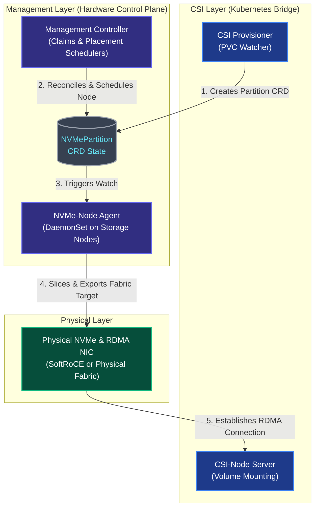

DISTORT is a Kubernetes-native storage engine specifically designed to manage dynamic, high-performance physical disk allocation. Utilizing NVMe-over-Fabrics (NVMe-oF) via RDMA target exports, it orchestrates direct block storage attachments directly between worker nodes at near-local speeds. 

DISTORT distinguishes itself by integrating high-performance user-space polling architectures (via SPDK) natively into Kubernetes Custom Resources. The project has evolved from an initial kernel-based configfs approach to a fully containerized SPDK engine, maintaining a zero-overhead data path without requiring heavyweight software-defined storage (SDS) middleware.

DISTORT's architecture is bifurcated into two logical layers: the **NVMe Management Layer** (the "Hardware Control Plane") and the **CSI Layer** (the "Kubernetes Bridge"). This separation of concerns allows the system to decouple physical hardware management from the Kubernetes volume lifecycle using a state-machine-via-CRD approach.

## High-Level Design

DISTORT consists of three main components:
1. **Manager (`distort-manager`)**: The centralized control plane component housing controllers for assigning claims to physical drives and scheduling NVMe partitions onto healthy nodes.
2. **Agent (`distort-agent`)**: A DaemonSet running on storage-providing nodes. It discovers physical NVMe controllers (`NVMeDevice`), manages user-space partitions using SPDK Logical Volumes (`lvol`), and exports NVMe-oF RDMA targets.
3. **CSI Driver (`distort-csi`)**: A standard Container Storage Interface implementation. It translates PersistentVolumeClaims into `NVMePartition` CRDs and coordinates client connections (`nvme connect`) and filesystem mounting on application nodes.

---

## Architectural Interaction & Flow

The following interactive sequence shows how the control plane and data path layers interact when provisioning disaggregated storage over RDMA:

---

## Custom Resource Definitions (CRDs)

At the core of DISTORT's declarative model are four Custom Resource Definitions that mirror the physical and logical state of the storage fabric:

1. **`NVMeDevice`:** Represents a discovered physical NVMe storage controller on a worker node, including attributes like serial number, NUMA alignment, and block capacity.
2. **`NVMeDeviceClaim`:** Allows administrators or automated provisioners to reserve specific `NVMeDevice` instances for dedicated workloads.
3. **`NVMePartition`:** Represents a logical slice of an `NVMeDevice`. It dictates the required capacity and, once scheduled, tracks the NVMe-oF network endpoint details (NQN, Portal IP, Port) required for client connections.
4. **`RDMAStorageNode`:** Represents a worker node's capability to participate in the storage fabric, providing health status and available network interfaces for RDMA traffic.

---

## Logical Components

### 1. NVMe Management Layer

This layer is responsible for physical device discovery, disk partitioning, and target exports. It comprises:
* **NVMe-Management-Controller:** Deployed as a centralized replica, it handles administration and placement logic. It reconciles `NVMeDeviceClaim` objects, allowing cluster administrators to claim specific disks by serial number. When an `NVMePartition` is requested without a pre-assigned node, this controller selects the optimal `RDMAStorageNode` based on available free capacity.
* **NVMe-Node-Agent:** Deployed as a DaemonSet across storage-providing nodes. It performs continuous discovery by scanning the PCIe bus for NVMe controllers and reporting active RDMA-capable NICs. Its execution loop watches for `NVMePartition` CRDs assigned to its resident node, slicing the physical media and configuring the targets.

### 2. CSI Layer (Kubernetes Bridge)

This layer translates standard PersistentVolumeClaims (PVCs) into concrete storage allocations and subsequently mounts the volumes to application Pods.
* **CSI-Provisioner:** A controller that watches for new PVCs. Instead of communicating with a traditional centralized storage backend API, it creates an `NVMePartition` CRD specifying the required capacity and access mode. It then blocks until the management layer updates the partition's status with an RDMA endpoint (NQN and Portal IP), at which point it binds the resulting PersistentVolume (PV).
* **CSI-Node-Server:** A DaemonSet located on the compute nodes consuming the storage. During the volume staging phase, it executes `nvme connect` against the NVMe-oF cluster, connecting the Pod to the remote block device (e.g., `/dev/nvme1n1`). It then bind-mounts this device into the corresponding container's root filesystem.

---

## Codebase Layout & Compilation

DISTORT is implemented in Go (version 1.23+), leveraging the `controller-runtime` and Kubebuilder frameworks to enforce operator paradigms. The system compiles into three distinct binaries located in the `cmd/` directory:

1. **`distort-manager`:** The control plane application housing the claims and placement schedulers.
2. **`distort-agent`:** The privileged hardware-interaction daemon.
3. **`distort-csi`:** Deployed per the Container Storage Interface spec, containing the Identity, Controller, and Node server gRPC implementations.

Building the binaries relies on a standard `Makefile` utilizing `go build`. Kubebuilder macros extract RBAC definitions and scheme topologies from Go structural comments, ensuring that API generations (`make manifests`) directly reflect the Go codebase.

---

## Target Orchestration Engine

DISTORT integrates the **Storage Performance Development Kit (SPDK)** to achieve high-performance I/O and reduce CPU overhead from kernel-space context switching. By leveraging SPDK, DISTORT completely bypasses the Linux kernel block layer:

* **User-Space NVMe Driver:** Physical NVMe drives are unbound from the kernel and bound to the `vfio-pci` or `uio_pci_generic` drivers, granting SPDK exclusive user-space access.
* **Discovery & RPC Control:** Hardware discovery and telemetry are orchestrated via SPDK's JSON-RPC interface, querying the `nvmf_tgt` process for controllers and serial numbers.
* **Logical Volumes (Lvol):** Instead of traditional filesystem partitions, DISTORT dynamically carves out SPDK Logical Volumes (`bdev_lvol_create`) entirely in application memory.
* **NVMe-oF Exporter:** Lightweight SPDK JSON-RPC commands dynamically create user-space NVMe-oF Subsystems and RDMA listeners on the fly.

Volume teardown employs Kubernetes **Finalizers**, intercepting `NVMePartition` deletion events to cleanly un-export the Fabric pathway via RPC before destroying the logical volume.

