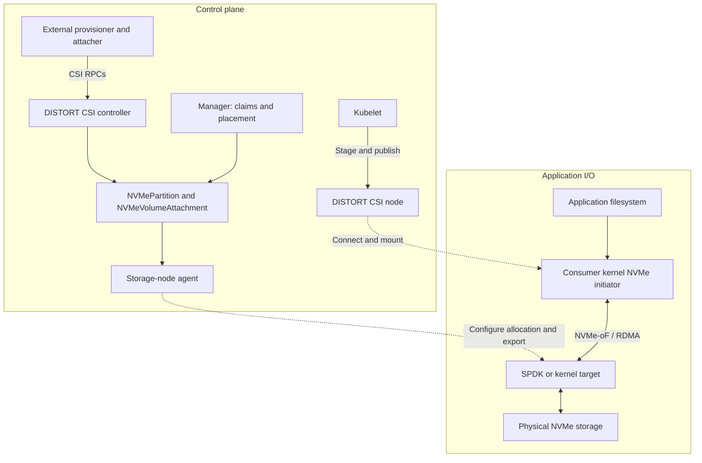

DISTORT allocates physical NVMe capacity through Kubernetes custom resources
and exposes volumes through CSI. Consumer nodes connect directly to storage
targets over NVMe-over-Fabrics/RDMA after provisioning and attachment complete.

Both SPDK user-space targets and Linux kernel configfs targets are implemented.
Management controllers coordinate storage lifecycle but do not carry application
I/O. This describes the architecture, not a measured performance guarantee.

DISTORT's architecture is bifurcated into two logical layers: the **NVMe Management Layer** (the "Hardware Control Plane") and the **CSI Layer** (the "Kubernetes Bridge"). This separation of concerns allows the system to decouple physical hardware management from the Kubernetes volume lifecycle using a state-machine-via-CRD approach.

## High-Level Design

DISTORT consists of three main components:
1. **Manager (`distort-manager`)**: The centralized control plane component housing controllers for assigning claims to physical drives and scheduling NVMe partitions onto healthy nodes.
2. **Agent (`distort-agent`)**: A DaemonSet running on storage-providing nodes. It discovers physical NVMe controllers (`NVMeDevice`), creates SPDK logical volumes or kernel-backed disk partitions, and exports NVMe-oF/RDMA targets.
3. **CSI Driver (`distort-csi`)**: A Container Storage Interface implementation. It translates provisioning requests into `NVMePartition` resources, maintains durable single-writer attachments, and coordinates client connections (`nvme connect`) and filesystem mounting on application nodes.

---

## Architectural Interaction & Flow

The diagram separates lifecycle coordination from application I/O:

---

## Custom Resource Definitions (CRDs)

At the core of DISTORT's declarative model are five Custom Resource Definitions that mirror the physical, logical, and attachment state of the storage fabric:

1. **`NVMeDevice`:** Represents a discovered physical NVMe storage controller on a worker node, including attributes like serial number, NUMA alignment, and the allocatable capacity of the explicitly managed namespace ID 1 after a small backend-metadata reserve. Additional namespaces remain untouched and are not advertised for placement.
2. **`NVMeDeviceClaim`:** Authorizes DISTORT to use a specific physical device, identified by serial number. It records ownership for allocation and cleanup; it is not a per-workload placement selector.
3. **`NVMePartition`:** Represents a logical slice of an `NVMeDevice`. It dictates the required capacity and, once scheduled, tracks the NVMe-oF network endpoint details (NQN, Portal IP, Port) required for client connections.
4. **`RDMAStorageNode`:** Represents a worker node's capability to participate in the storage fabric, providing health status and available network interfaces for RDMA traffic.
5. **`NVMeVolumeAttachment`:** Records the one authorized consumer node, host NQN, and attachment lifetime for a partition so target ACL changes and CSI retries remain durable and observable.

---

## Logical Components

### 1. NVMe Management Layer

This layer is responsible for physical device discovery, disk partitioning, and target exports. It comprises:
* **NVMe-Management-Controller:** Deployed as a centralized replica, it handles administration and placement logic. It reconciles `NVMeDeviceClaim` objects, allowing cluster administrators to claim specific disks by serial number. When an `NVMePartition` is requested without a pre-assigned node, this controller selects the optimal `RDMAStorageNode` based on available free capacity.
* **NVMe-Node-Agent:** Deployed as a DaemonSet across storage-providing nodes. It performs continuous discovery by scanning the PCIe bus for NVMe controllers and reporting active RDMA-capable NICs. Its execution loop watches for `NVMePartition` CRDs assigned to its resident node, slicing the physical media and configuring the targets.

### 2. CSI Layer (Kubernetes Bridge)

This layer translates standard PersistentVolumeClaims (PVCs) into concrete storage allocations and subsequently mounts the volumes to application Pods.
* **CSI-Provisioner:** The external-provisioner watches PVCs and calls DISTORT's `CreateVolume` RPC. The DISTORT CSI controller creates an `NVMePartition` resource and waits for the agent to publish its export endpoint after manager placement. The provisioner then creates the PersistentVolume (PV) for binding.
* **CSI-Attacher:** Calls `ControllerPublishVolume` and `ControllerUnpublishVolume`. DISTORT persists one `NVMeVolumeAttachment` per immutable partition UID and updates the target host ACL before reporting the attachment ready.
* **CSI-Node-Server:** A DaemonSet on consumer nodes. It connects to the authorized NVMe-oF target, detects or formats the requested filesystem, mounts it at the kubelet staging path, and bind-mounts that filesystem into the Pod's volume path.

---

## Codebase Layout & Compilation

DISTORT is implemented in Go 1.25.3+, leveraging the `controller-runtime` and Kubebuilder frameworks to enforce operator paradigms. The system compiles into three distinct binaries located in the `cmd/` directory:

1. **`distort-manager`:** The control plane application housing the claims and placement schedulers.
2. **`distort-agent`:** The privileged hardware-interaction daemon.
3. **`distort-csi`:** Deployed per the Container Storage Interface spec, containing the Identity, Controller, and Node server gRPC implementations.

Building the binaries relies on a standard `Makefile` utilizing `go build`. Kubebuilder macros extract RBAC definitions and scheme topologies from Go structural comments, ensuring that API generations (`make manifests`) directly reflect the Go codebase.

---

## Target Orchestration Engine

The SPDK backend uses the **Storage Performance Development Kit** for
target-side user-space NVMe access. This bypass applies to the storage target;
consumer nodes still use the Linux kernel NVMe initiator and filesystem stack.
Polling consumes CPU even when application I/O is low.

* **User-Space NVMe Driver:** Physical NVMe drives are unbound from the kernel and bound to the `vfio-pci` or `uio_pci_generic` drivers, granting SPDK exclusive user-space access.
* **Discovery & RPC Control:** Hardware discovery and telemetry are orchestrated via SPDK's JSON-RPC interface, querying the `nvmf_tgt` process for controllers and serial numbers.
* **Logical Volumes (Lvol):** SPDK allocates logical volumes from a store on the physical NVMe block device. Volume data and allocation metadata reside on storage; the target's listeners and subsystems are runtime configuration.
* **NVMe-oF Exporter:** Lightweight SPDK JSON-RPC commands dynamically create user-space NVMe-oF Subsystems and RDMA listeners on the fly.

Volume teardown employs Kubernetes **Finalizers**, intercepting `NVMePartition` deletion events to cleanly un-export the Fabric pathway via RPC before destroying the logical volume.

## Identity and ownership checks

Device authorization and volume identity are persisted in Kubernetes rather than inferred from mutable names:

- A claimed `NVMeDevice` records the claim namespace, name, and immutable UID. The agent verifies that exact live claim before performing host or SPDK operations.
- Each new `NVMePartition` derives a backend-safe external identity from its immutable UID. CSI handles include namespace, name, and UID so same-named volumes in different namespaces cannot alias one another.
- Legacy name-only volume handles remain readable only through a fail-safe compatibility path; ambiguous matches are never deleted.

Consumer-side ownership is also explicit. The chart declares `attachRequired: true`, the CSI controller implements `ControllerPublishVolume` and `ControllerUnpublishVolume`, and a durable `NVMeVolumeAttachment` authorizes exactly one node and host NQN at a time. A competing node is rejected. Forced takeover requires an administrator to confirm fencing and annotate the current attachment before the agent revokes the old ACL and grants the replacement. Final two-node hardware verification of the corrected takeover path remains pending.

## Current capability boundary

Device claims authorize use of physical media; they are not a per-namespace
tenant quota or a network isolation mechanism. Placement considers eligible
claimed devices across namespaces. Administrators must control access to claims,
storage resources, privileged workloads, and the RDMA fabric. Host-NQN access
control does not by itself provide cryptographic authentication or encryption.

DISTORT is an alpha-stage project moving toward beta. Its development releases
are not recommended for production use. The implemented path includes
claimed-device authorization, namespace-safe volume identity, durable
single-writer attachment ownership, transactional SPDK startup, exact SPDK and
kernel target checks, ext4/XFS detection and formatting, fail-safe CSI
request/path validation, and readiness-aware RDMA and NVMe inventory placement.
Remaining work includes durable capacity reservation across leadership overlap,
CSI conformance, and final hardware recovery and fencing evidence.

For controller-by-controller behavior and recovery details, see
[Project Internals](/internals/).
