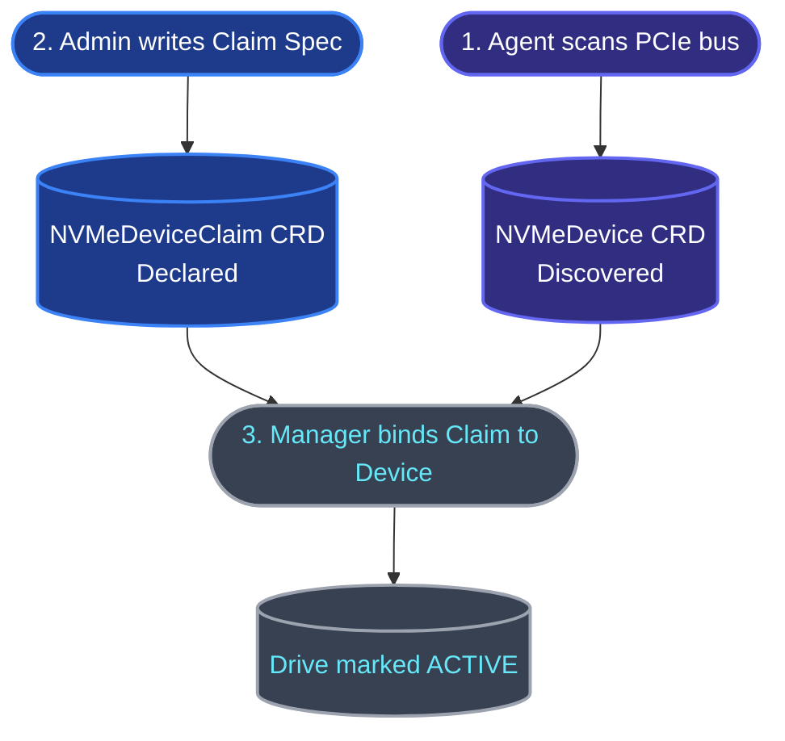

Once DISTORT is deployed, it seamlessly integrates with standard Kubernetes storage workflows. This guide covers how administrators manage physical hardware and how developers request high-performance RDMA storage volumes.

---

## Hardware Discovery & Device Allocation

By design, DISTORT decouples **physical drive discovery** from **workload allocation**. This ensures that administrators have full, declarative control over which physical devices are consumed by the storage engine.



---

### Step 1: Discover Underlying Hardware

The `distort-agent` DaemonSet scans the PCIe bus on every storage-providing worker node and dynamically publishes discovered drives as cluster-wide `NVMeDevice` resources. 

To view the discovered hardware in your cluster:

```bash
kubectl get nvmedevices
```

This returns a list of discovered controllers, showing their status, capacity, NUMA alignment, serial number, and hosting node.

### Step 2: Allocate Drives via `NVMeDeviceClaim`

To make a discovered physical device available for partitioning and pod allocation, an administrator must **claim** it. 

Claims are declared using the **`NVMeDeviceClaim`** resource, targeting the exact hardware **`serialNumber`** of the discovered device. This guarantees that if a drive is moved to a different PCIe slot or worker node, the system preserves the allocation mapping.

Create an `nvme-claim.yaml` file:

```yaml
apiVersion: storage.distort.io/v1alpha1
kind: NVMeDeviceClaim
metadata:
  name: claim-samsung-evo-1
spec:
  # The serial number uniquely identifying the physical disk
  serialNumber: "SN-distort-worker-1"
```

Apply the claim:

```bash
kubectl apply -f nvme-claim.yaml
```

The `distort-manager` matches the claim with the physical `NVMeDevice`. Once bound, the claim's status transitions to `Active: true`. You can verify this by running:

```bash
kubectl get nvmedeviceclaims
```

---

## Dynamic Storage Provisioning

Once hardware claims are active, developers can request volume allocations using standard Kubernetes StorageClasses and PVCs.

### 1. Define a StorageClass

DISTORT supports multiple backends and volume carving configurations. These are specified through standard Kubernetes StorageClass parameters.

#### StorageClass Parameters

| Parameter | Type | Allowed Values | Default | Description |
|---|---|---|---|---|
| `target-backend` | String | `spdk`, `kernel` | `spdk` | The target export technology to run on the storage nodes. |
| `volume-manager` | String | `partition` (or `lvm` in future) | `partition` | The volume carving method to slice physical drives. |
| `spdk-core-mask` | String | CPU mask (e.g., `0x1`, `0x3`) | `0x1` | Core affinity mask to pass to the SPDK target daemon (SPDK only). |

> [!WARNING]
> **Data Destruction on Backend Swap:**
> Physical NVMe devices are locked to the target backend driver (SPDK's user-space vfio-pci vs Kernel's nvme driver) of their first provisioned volume.
> If you allocate volumes from different StorageClasses with conflicting backends on the same node, they must target separate disks. Reconfiguring a disk to shift between SPDK and kernel backends requires wiping all partition tables and is highly destructive.
> Because of this, DISTORT does not register a default StorageClass upon installation.

#### Example StorageClass Configurations

**Option A: SPDK User-Space Target with Logical Volumes (Sane Default)**
```yaml
apiVersion: storage.k8s.io/v1
kind: StorageClass
metadata:
  name: distort-spdk-partition
provisioner: storage.distort.io
volumeBindingMode: WaitForFirstConsumer
parameters:
  target-backend: "spdk"
  volume-manager: "partition"
  spdk-core-mask: "0x1"
```

**Option B: Linux Kernel Target with Partitions**
```yaml
apiVersion: storage.k8s.io/v1
kind: StorageClass
metadata:
  name: distort-kernel-partition
provisioner: storage.distort.io
volumeBindingMode: WaitForFirstConsumer
parameters:
  target-backend: "kernel"
  volume-manager: "partition"
```

Apply the chosen StorageClass:

```bash
kubectl apply -f storageclass.yaml
```

### 2. Request a Volume via PVC

Developers can now create a `PersistentVolumeClaim` (PVC) referencing the DISTORT StorageClass:

```yaml
apiVersion: v1
kind: PersistentVolumeClaim
metadata:
  name: rdma-pvc
spec:
  accessModes:
    - ReadWriteOnce
  storageClassName: distort-rdma
  resources:
    requests:
      storage: 500Mi
```

Apply the PVC:

```bash
kubectl apply -f pvc.yaml
```

### 3. Under the Hood Lifecycle
1. The **CSI-Provisioner** intercepts the PVC request.
2. Rather than creating a block loop file on a local filesystem, it creates a new **`NVMePartition`** CRD requesting `500Mi` of capacity.
3. The centralized **`distort-manager`** reconciles the partition, finding an active `NVMeDeviceClaim` on a healthy node with sufficient free space.
4. The local **`distort-agent`** DaemonSet on that node watches the partition, dynamically carves out an SPDK user-space Logical Volume (Lvol) in memory, and exposes it over the network as an NVMe-oF target.
5. The **CSI-Node-Server** on the compute node executing the application Pod connects to the remote target over the SoftRoCE/RDMA network, formats the block device with `ext4`, and bind-mounts it directly into the container!
